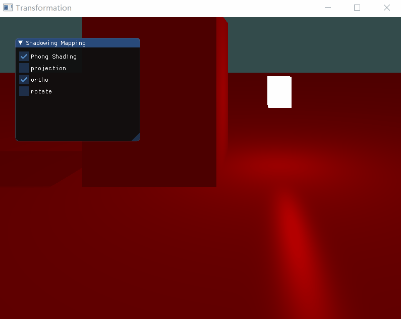
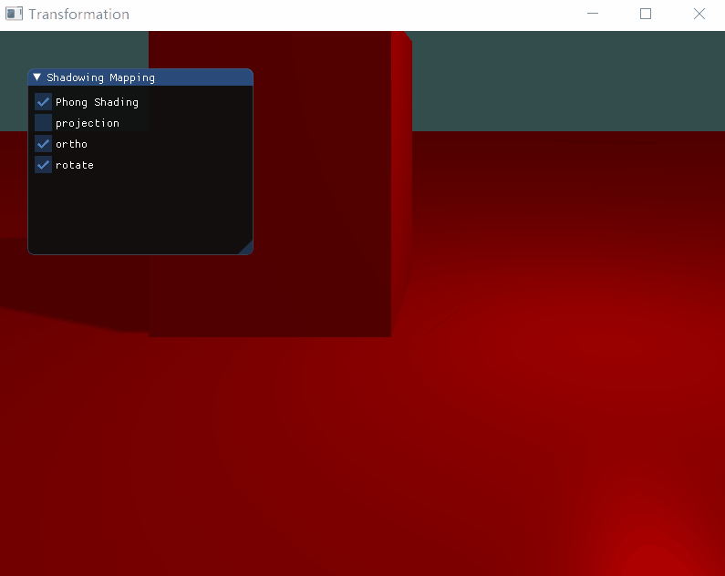

# 计算机图形学HW7
姓名：陈谱一    学号：16340026
## Basic:
1. 实现方向光源的Shadowing Mapping:
- 要求场景中至少有一个object和一块平面(用于显示shadow)
- 光源的投影方式任选其一即可
- 在报告里结合代码，解释Shadowing Mapping算法

**定义平面**

创建平面和创建立方体类似，首先定义顶点坐标，然后新建平面VAO和VBO：
```
//平面VAO
GLuint planeVBO;
glGenVertexArrays(1, &planeVAO);
glBindVertexArray(planeVAO);
glGenBuffers(1, &planeVBO);

glBindBuffer(GL_ARRAY_BUFFER, planeVBO);
glBufferData(GL_ARRAY_BUFFER, sizeof(planeVertices), planeVertices, GL_STATIC_DRAW);

glVertexAttribPointer(0, 3, GL_FLOAT, GL_FALSE, 6 * sizeof(GLfloat), (GLvoid*)0);
glEnableVertexAttribArray(0);
glVertexAttribPointer(1, 3, GL_FLOAT, GL_FALSE, 6 * sizeof(GLfloat), (GLvoid*)(3 * sizeof(GLfloat)));
glEnableVertexAttribArray(1);
glBindVertexArray(0);
```

**深度贴图**

深度贴图是从光的透视图里渲染深度纹理，用其来计算阴影。主要分成三步：
- 创建一个帧缓冲对象
- 创建一个2D纹理
- 把生成的深度纹理作为帧缓冲的深度缓冲
在此之后可以生成深度贴图了：首先渲染深度贴图，然后通过深度贴图来渲染场景：
```
glViewport(0, 0, SHADOW_WIDTH, SHADOW_HEIGHT);
glBindFramebuffer(GL_FRAMEBUFFER, depthMapFBO);
glClear(GL_DEPTH_BUFFER_BIT);
RenderScene(depthShader);
glBindFramebuffer(GL_FRAMEBUFFER, 0);
```

**变换光源空间**

从光的视野来使用不同的投影和视图矩阵渲染场景。这里使用正交投影，为了创建一个视图矩阵来将物体变换到光源视角的可见空间中，使用lookAt函数，从光源位置看向场景中央。最后把二者相乘得到渲染所需的lightSpaceMatrix：
```
else if (orthoType) {
	lightProjection = glm::ortho(-8.0f, 8.0f, -8.0f, 8.0f, near_plane, far_plane);
}

lightView = glm::lookAt(lightPos, glm::vec3(0.0f), glm::vec3(0.0, 1.0, 0.0));
lightSpaceMatrix = lightProjection * lightView;
```
lightSpaceMatrix只需要给shader提供变换矩阵就可以渲染场景了。

**渲染至深度值和阴影**

首先以光的透视图来进行场景渲染，新建一个简单的顶点着色器把顶点变换到光空间以外：
```
gl_Position = lightSpaceMatrix * model * vec4(position, 1.0f);
```
对应的片段着色器不需要做任何事情，可以为空。

然后渲染阴影，使用Phong光照模型，用像素着色器来检验一个片元是否在阴影中。在顶点着色器中进行光空间的变换：
```
vs_out.FragPos = vec3(model * vec4(aPos, 1.0));
vs_out.Normal = transpose(inverse(mat3(model))) * aNormal;
vs_out.TexCoords = aTexCoords;
vs_out.FragPosLightSpace = lightSpaceMatrix * vec4(vs_out.FragPos, 1.0);
gl_Position = projection * view * model * vec4(aPos, 1.0);
```
接着计算shadow值，阴影中的值是1.0，阴影外的值是0.0，然后用diffuse和specular乘这个阴影元素，片段着色器的主体代码如下：
```
vec3 color = texture(diffuseTexture, fs_in.TexCoords).rgb;
vec3 normal = normalize(fs_in.Normal);
vec3 lightColor = vec3(0.3);
//环境光
vec3 ambient = 0.3 * color;
//漫反射
vec3 lightDir = normalize(lightPos - fs_in.FragPos);
float diff = max(dot(lightDir, normal), 0.0);
vec3 diffuse = diff * lightColor;
//镜面反射
vec3 viewDir = normalize(viewPos - fs_in.FragPos);
vec3 reflectDir = reflect(-lightDir, normal);
float spec = 0.0;
vec3 halfwayDir = normalize(lightDir + viewDir);  
spec = pow(max(dot(normal, halfwayDir), 0.0), 64.0);
vec3 specular = spec * lightColor;    
// 计算阴影
float shadow = ShadowCalculation(fs_in.FragPosLightSpace);                
vec3 lighting = (ambient + (1.0 - shadow) * (diffuse + specular)) * color;

FragColor = vec4(lighting, 1.0);
```
注意上述代码中还有一个ShadowCalculation函数来计算阴影：
```
vec3 projCoords = fragPosLightSpace.xyz / fragPosLightSpace.w;
projCoords = projCoords * 0.5 + 0.5;
float closestDepth = texture(shadowMap, projCoords.xy).r; 
float currentDepth = projCoords.z;
float shadow = currentDepth > closestDepth  ? 1.0 : 0.0;
```
至此可以看到物体的阴影了。

2. 修改GUI
修改GUI如下，主要是几个checkbox来选择不同投影下的光照：
```
//ImGui
{
	ImGui::Begin("Shadowing Mapping");
	ImGui::Checkbox("Phong Shading", &pShading);
	ImGui::Checkbox("projection", &projectionType);
	ImGui::Checkbox("ortho", &orthoType);
	ImGui::Checkbox("rotate", &rotate);
	ImGui::End();
}
```

## Basic:
1. 实现光源在正交/透视两种投影下的Shadowing Mapping
之前实现的是透视投影，增加正交投影非常简单，只要加一个判断条件即可：
```
if (projectionType) {
	lightProjection = glm::perspective(glm::radians(120.0f), (float)SCR_WIDTH / (float)SCR_HEIGHT, 0.1f, 100.0f);
}
else if (orthoType) {
	lightProjection = glm::ortho(-8.0f, 8.0f, -8.0f, 8.0f, near_plane, far_plane);
}
```
2. 优化Shadowing Mapping
阴影虽然生成了，但是如果放大会看到很多锯齿，这是因为深度贴图有一个解析度，多个片元对应同一个纹理像素，结果就是多个片元从深度贴图的同一个深度值采样，从而产生锯齿边。使用PCF来解决这个问题，从深度贴图中多次采样，最后进行平均可消除锯齿。在片段着色器中增加代码如下：
```
float shadow = 0.0;
vec2 texelSize = 1.0 / textureSize(shadowMap, 0);
for(int x = -1; x <= 1; ++x)
{
    for(int y = -1; y <= 1; ++y)
    {
        float pcfDepth = texture(shadowMap, projCoords.xy + vec2(x, y) * texelSize).r;
        shadow += currentDepth - bias > pcfDepth  ? 1.0 : 0.0;        
    }    
}
shadow /= 9.0;
```
最后的实验结果如下图：

正交投影：



透视投影：

